# NotNow Application Design Documentation

## Table of Contents
1. [Architecture Overview](#architecture-overview)
2. [Component Structure](#component-structure)
3. [Core Classes](#core-classes)
4. [Issue State Management](#issue-state-management)
5. [Command Execution Flow](#command-execution-flow)
6. [UI Event Flows](#ui-event-flows)
7. [Data Synchronization](#data-synchronization)
8. [Filter and Search Operations](#filter-and-search-operations)

## Architecture Overview

### High-Level Component Diagram

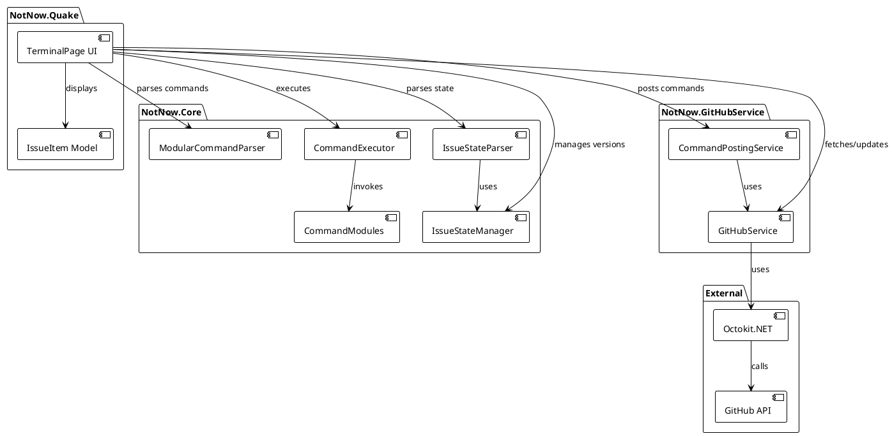

## Component Structure

### Service Dependencies

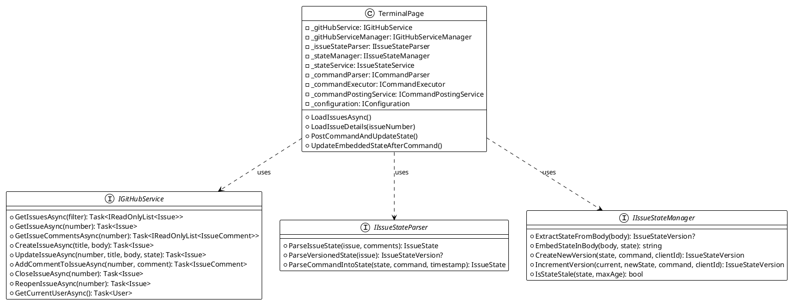

## Core Classes

### Issue State Models

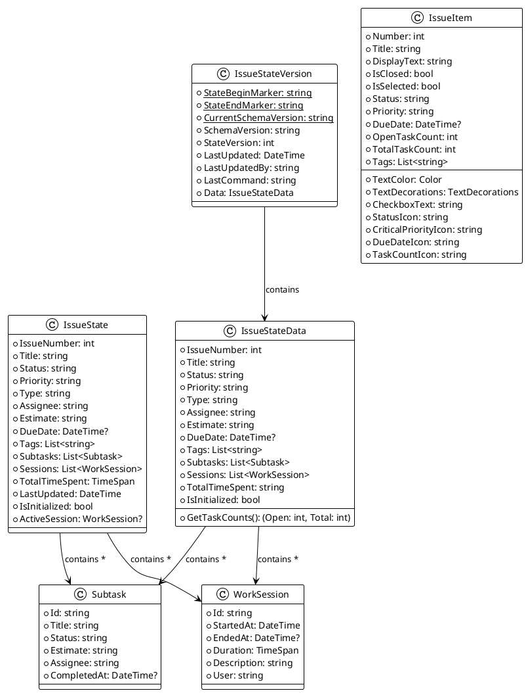

## Issue State Management

### State Resolution Flow

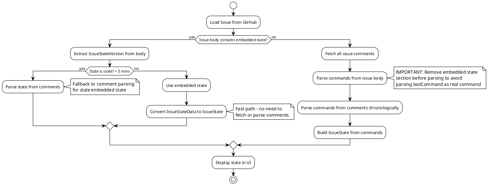

### Embedded State Update Process

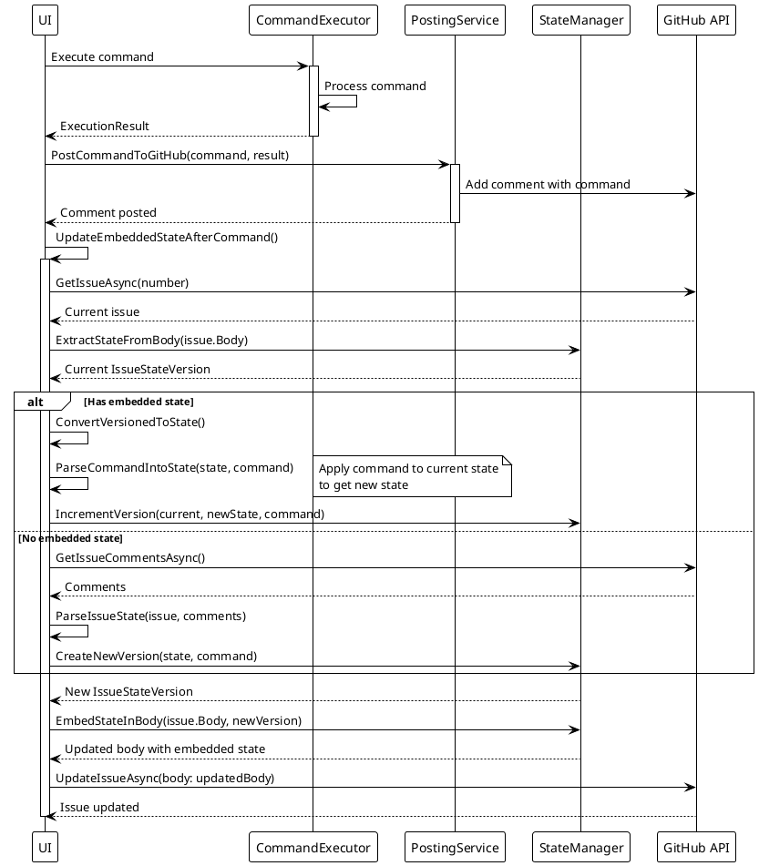

## Command Execution Flow

### Command Processing Pipeline

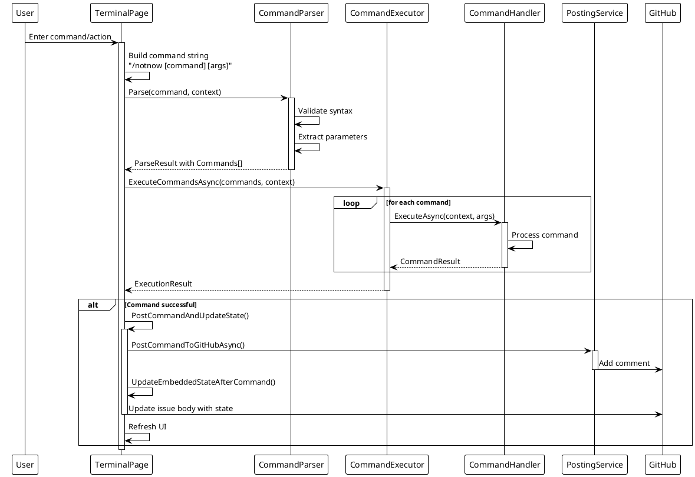

### Command Types and Handlers

```plantuml
@startuml
!theme plain

abstract class CommandHandler<T> {
    + {abstract} ExecuteAsync(context, args): Task<CommandResult>
}

class InitCommandHandler {
    + ExecuteAsync(): Initialize tracking
}

class StatusCommandHandler {
    + ExecuteAsync(): Change status
}

class PriorityCommandHandler {
    + ExecuteAsync(): Set priority
}

class AssignCommandHandler {
    + ExecuteAsync(): Assign user
}

class TagsCommandHandler {
    + ExecuteAsync(): Add/remove tags
}

class SubtaskCommandHandler {
    + ExecuteAsync(): Manage subtasks
}

class TimeCommandHandler {
    + ExecuteAsync(): Log time
}

class EstimateCommandHandler {
    + ExecuteAsync(): Set estimate
}

class DueCommandHandler {
    + ExecuteAsync(): Set due date
}

CommandHandler <|-- InitCommandHandler
CommandHandler <|-- StatusCommandHandler
CommandHandler <|-- PriorityCommandHandler
CommandHandler <|-- AssignCommandHandler
CommandHandler <|-- TagsCommandHandler
CommandHandler <|-- SubtaskCommandHandler
CommandHandler <|-- TimeCommandHandler
CommandHandler <|-- EstimateCommandHandler
CommandHandler <|-- DueCommandHandler

@enduml
```

## UI Event Flows

### Issue Loading and Display

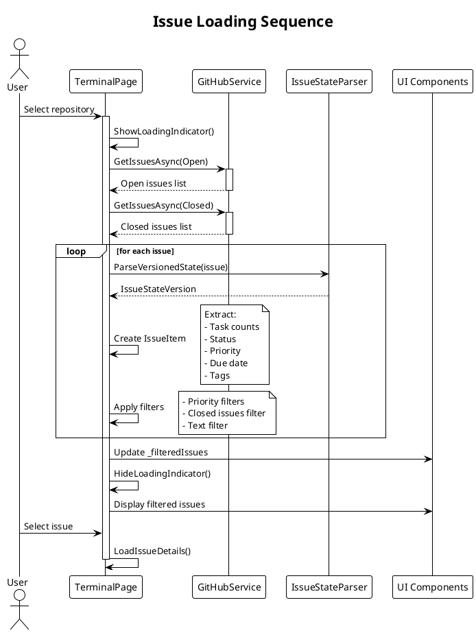

### Tag Management Flow

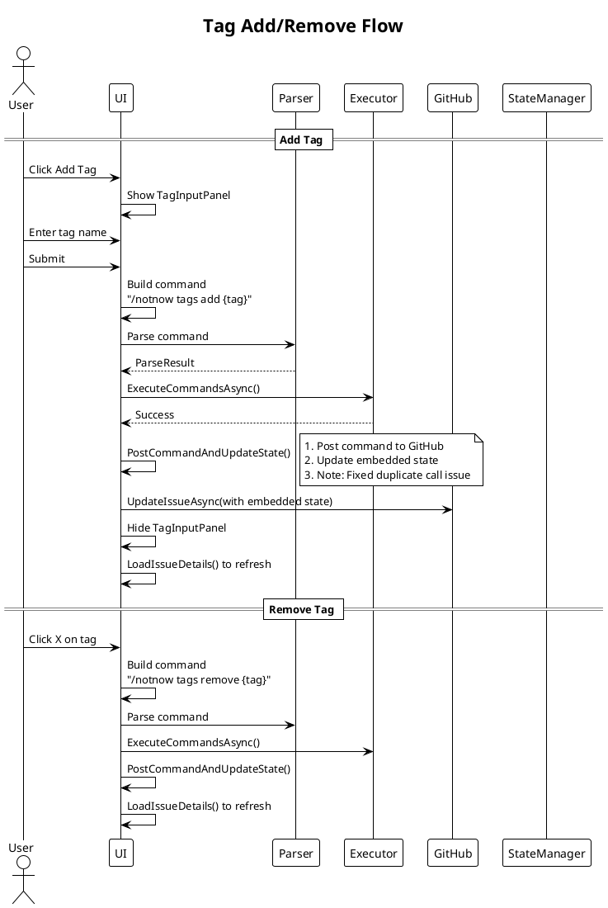

### Filter Operations

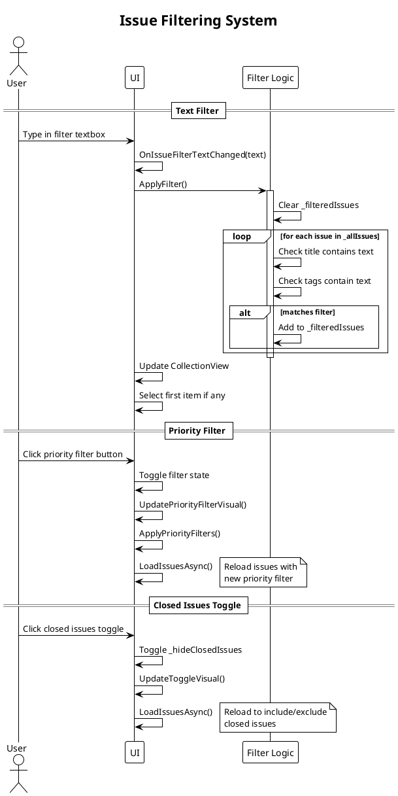

## Data Synchronization

### State Synchronization Between UI and GitHub

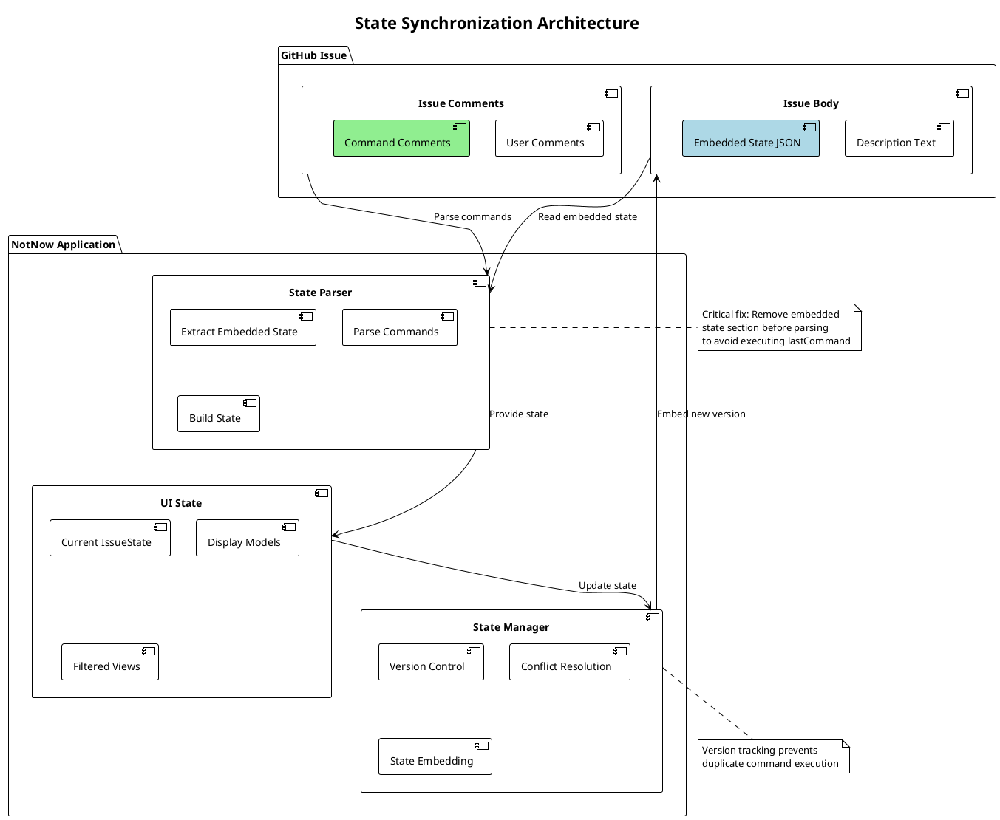

### Command Posting and State Update

```plantuml
@startuml
!theme plain

title Command Post and State Update Timing

participant "User Action" as User
participant "UI Thread" as UI
participant "Command Executor" as Exec
participant "GitHub API" as API
participant "State Manager" as SM

User -> UI: Trigger command
activate UI

UI -> Exec: Execute locally
activate Exec
Exec --> UI: Local result
deactivate Exec

par Post to GitHub
    UI -> API: Post command comment
    activate API
    API --> UI: Comment created
    deactivate API
and Update embedded state
    UI -> SM: Update state version
    activate SM
    SM -> API: Get current issue
    API --> SM: Issue data
    SM -> SM: Apply command to state
    SM -> SM: Increment version
    SM -> API: Update issue body
    API --> SM: Updated
    SM --> UI: State updated
    deactivate SM
end

UI -> UI: Wait(PostCommandDelay)
note right
    Default 1000ms delay to
    ensure GitHub processes
end note

UI -> UI: Reload issue details
UI -> API: Fetch updated issue
API --> UI: Latest state

deactivate UI

@enduml
```

## Filter and Search Operations

### Issue List Filtering Architecture

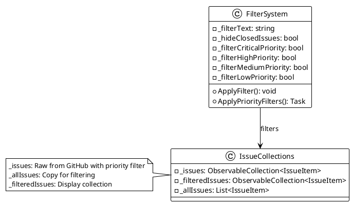

### Loading Indicator Animation

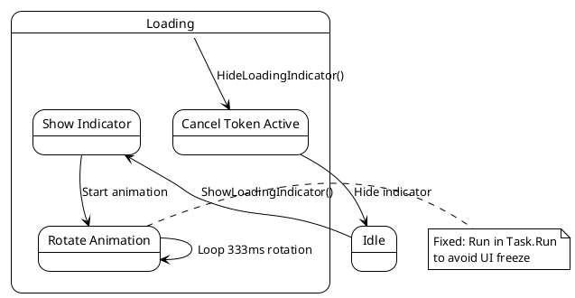

## Known Issues and Fixes

### Issue: Duplicate Tags with Escaped Quotes
**Problem**: Tags appeared twice, with one having an escaped quote character.

**Root Cause**: When parsing state from comments (fallback path), the parser was also parsing the `/notnow` command inside the embedded state's `lastCommand` JSON field as a real command.

**Fix**: Modified `ParseIssueState` to remove the embedded state section before parsing commands from the issue body.

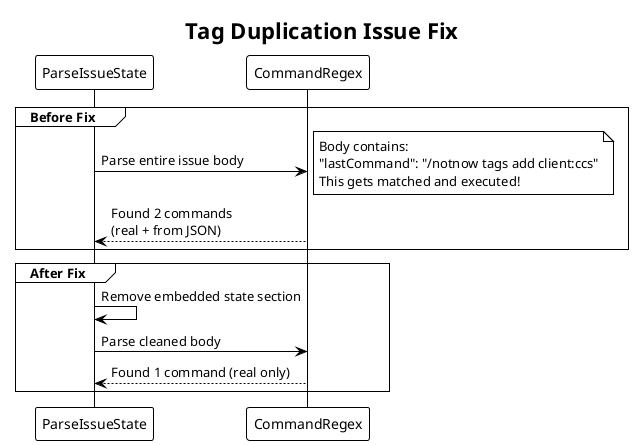

### Issue: Duplicate UpdateEmbeddedStateAfterCommand Calls
**Problem**: State was being updated twice, causing version increments without changes.

**Root Cause**: `PostCommandAndUpdateState` already calls `UpdateEmbeddedStateAfterCommand`, but some methods were calling it again.

**Fix**: Removed duplicate calls to `UpdateEmbeddedStateAfterCommand`.

## Performance Optimizations

### Embedded State Benefits

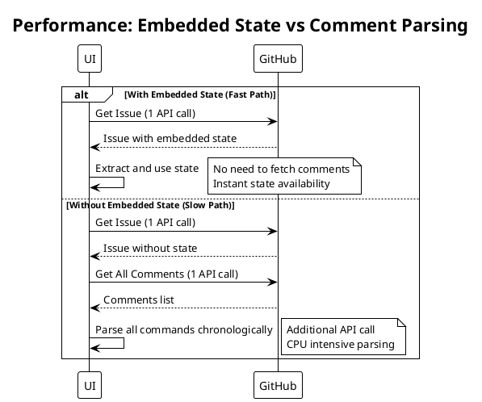

## Subtask Management

### Subtask Lifecycle

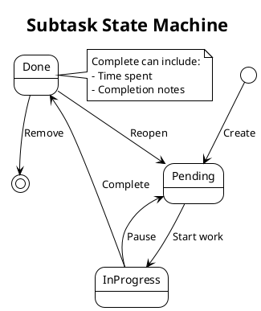

### Subtask Command Processing

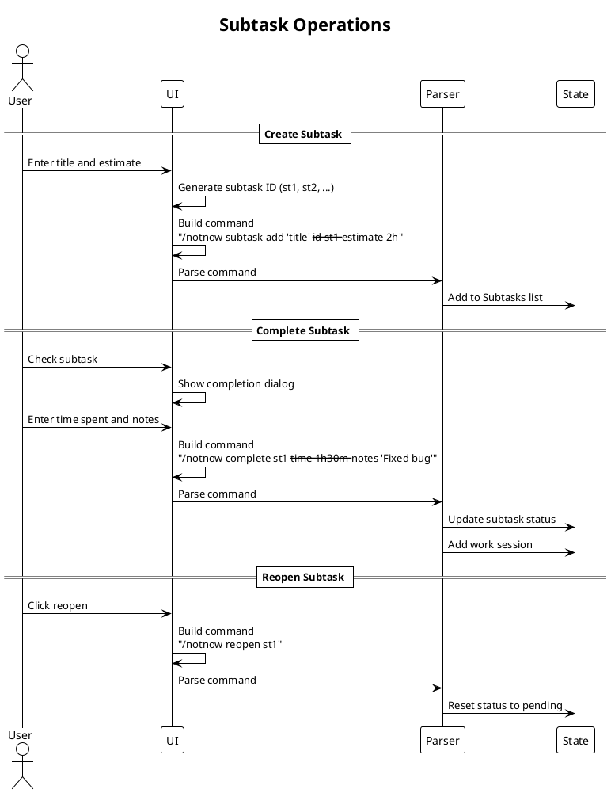

## Time Tracking System

### Work Session Management

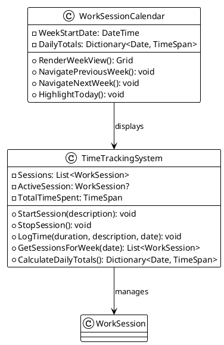

### Time Tracking UI Flow

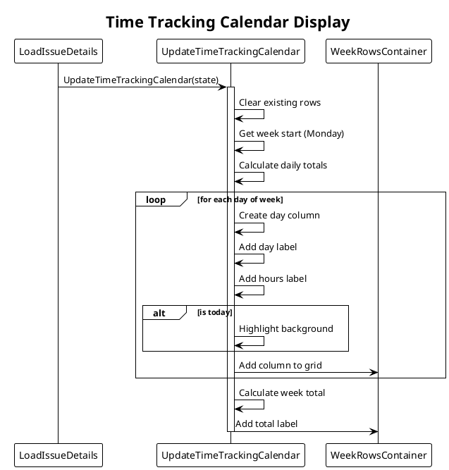

## Issue Creation Flow

### New Issue with Auto-Commands

```plantuml
@startuml
!theme plain

title Issue Creation with Initialization

actor User
participant "UI" as UI
participant "GitHub" as GH
participant "Commands" as Cmd

User -> UI: Fill issue form
note right
    - Title (required)
    - Description (required)
    - Due Date (optional)
    - Estimate (optional)
end note

User -> UI: Submit

UI -> GH: CreateIssueAsync(title, description)
GH --> UI: New issue created

UI -> Cmd: Post "/notnow init"
UI -> Cmd: Post "/notnow status todo"
UI -> Cmd: Post "/notnow priority medium"

alt Current user available
    UI -> Cmd: Post "/notnow assign {username}"
end

alt Due date provided
    UI -> UI: Validate date format (YYYY-MM-DD)
    UI -> Cmd: Post "/notnow due {date}"
end

alt Estimate provided
    UI -> UI: Validate estimate format (1h30m)
    UI -> Cmd: Post "/notnow estimate {time}"
end

UI -> UI: Wait for processing
UI -> UI: Refresh issues list

@enduml
```

## Status and Priority Management

### Status Button States

```plantuml
@startuml
!theme plain

title Status Management UI

state "Status Buttons" as Buttons {
    state "Todo" as Todo
    state "In Progress" as InProgress
    state "Blocked" as Blocked
    state "Done" as Done

    Todo --> InProgress : Click
    InProgress --> Blocked : Click
    InProgress --> Done : Click
    Blocked --> InProgress : Click
    Done --> Todo : Reopen issue
}

note right of Buttons
    Visual states:
    - Active: Blue background
    - Inactive: Dark background
    - All have blue borders
end note

@enduml
```

### Priority System

```plantuml
@startuml
!theme plain

class PrioritySystem {
    + Critical : "🔴 Urgent"
    + High : "🟡 Important"
    + Medium : "🔵 Normal"
    + Low : "⚪ Low"
}

class PriorityFilter {
    - _filterCriticalPriority: bool
    - _filterHighPriority: bool
    - _filterMediumPriority: bool
    - _filterLowPriority: bool
    --
    + ToggleFilter(priority): void
    + ApplyToIssueList(): void
    + UpdateButtonVisual(): void
}

note bottom of PriorityFilter
    Filters only apply to
    open issues, not closed
end note

@enduml
```

## Repository Management

### Multi-Repository Support

```plantuml
@startuml
!theme plain

class GitHubServiceManager {
    - _services: Dictionary<string, IGitHubService>
    - _currentService: IGitHubService
    - _configuration: GitHubConfig
    --
    + InitializeServices(config): void
    + SwitchRepository(repoId): void
    + GetCurrentRepository(): RepositoryInfo
    + GetRepositories(): List<RepositoryInfo>
}

class GitHubRepositoryConfig {
    + Id: string
    + Owner: string
    + Repository: string
    + PersonalAccessToken: string
    + DisplayName: string
}

GitHubServiceManager --> GitHubService : manages multiple
GitHubServiceManager --> GitHubRepositoryConfig : configured by

@enduml
```

## Error Handling and Validation

### Input Validation Flow

```plantuml
@startuml
!theme plain

title Input Validation System

start

if (Input is Date?) then (yes)
    if (Matches YYYY-MM-DD?) then (yes)
        if (Date >= Today?) then (yes)
            :Accept;
        else (no)
            :Show "Date cannot be in past";
        endif
    else (no)
        :Show "Invalid date format";
    endif
elseif (Input is Estimate?) then (yes)
    if (Matches time pattern?) then (yes)
        :Parse duration;
        :Accept;
    else (no)
        :Show "Use format like 1d2h30m";
    endif
elseif (Input is Tag?) then (yes)
    if (Not empty?) then (yes)
        if (No special chars?) then (yes)
            :Accept;
        else (no)
            :Show "Invalid characters in tag";
        endif
    else (no)
        :Show "Tag cannot be empty";
    endif
else (other)
    :Validate based on type;
endif

stop

@enduml
```

## Loading and Performance

### Async Operation Pattern

```plantuml
@startuml
!theme plain

title Async Loading Pattern

participant "UI Action" as Action
participant "Loading Indicator" as Loading
participant "Async Operation" as Async
participant "UI Update" as Update
participant "Error Handler" as Error

Action -> Loading: ShowLoadingIndicator()
activate Loading
Loading -> Loading: Start rotation animation

Action -> Async: Begin async operation
activate Async

alt Success
    Async --> Action: Result data
    Action -> Update: Update UI with data
else Failure
    Async --> Action: Exception
    Action -> Error: DisplayAlert(error)
end

deactivate Async

Action -> Loading: HideLoadingIndicator()
Loading -> Loading: Cancel animation
deactivate Loading

@enduml
```

## Configuration System

### Settings and Configuration

```plantuml
@startuml
!theme plain

class Configuration {
    + GitHubRepositories: List<GitHubRepositoryConfig>
    + DefaultRepositoryId: string
    + PostCommandDelay: int
    + StateStaleTimeout: TimeSpan
    + MaxIssuesOpen: int
    + MaxIssuesClosed: int
}

class SettingsLoader {
    - _configPath: string
    --
    + LoadConfiguration(): Configuration
    + SaveConfiguration(config): void
    + ValidateConfig(config): bool
}

note right of Configuration
    Loaded from:
    - appsettings.json
    - settings.local.json (override)
end note

@enduml
```

## Critical Bug Fixes Documentation

### Fix 1: Duplicate Command Execution
**Location**: `TerminalPage.xaml.cs` line 2103
**Issue**: `UpdateEmbeddedStateAfterCommand` called twice
**Fix**: Removed duplicate call after `PostCommandAndUpdateState`

### Fix 2: Tag Parsing from Embedded State
**Location**: `IssueStateParser.cs` line 44-50
**Issue**: Commands in JSON `lastCommand` field parsed as real commands
**Fix**: Strip embedded state section before parsing commands

### Fix 3: Loading Animation UI Freeze
**Location**: `TerminalPage.xaml.cs` line 2500
**Issue**: Infinite loop in UI thread
**Fix**: Moved animation to background Task with UI marshaling

## Advanced Architectural Patterns

### Timer Architecture

```plantuml
@startuml
!theme plain

class TimerSystem {
    - _workTimer: DispatcherTimer
    - _countdownTimer: DispatcherTimer
    - _workTimerRunning: bool
    - _countdownTimerRunning: bool
    - _workTimerStartTime: DateTime?
    - _workTimerElapsed: TimeSpan
    - _countdownSeconds: int
    - _countdownRemainingSeconds: int
    --
    + OnWorkTimerToggle(): void
    + OnCountdownTimerStartStop(): void
    + ShowTimerNotification(): Task
    + UpdateTimerDisplays(): void
}

class NotificationSystem {
    - ToastNotification (Windows)
    - WinRT Notification (Fallback)
    - DisplayAlert (Final Fallback)
    --
    + ShowTimerNotification(): Task
    + TryWindowsToast(): bool
    + TryWinRTNotification(): bool
    + FallbackToAlert(): Task
}

TimerSystem --> NotificationSystem : uses

note right of NotificationSystem
    Multi-layer fallback ensures
    notifications work across
    different Windows versions
end note

@enduml
```

### Time Tracking Calendar System

```plantuml
@startuml
!theme plain

title Advanced Time Tracking Architecture

class CalendarNavigationSystem {
    - _weekNavigationOffset: int
    - _currentIssueState: IssueState
    --
    + OnPreviousWeekClicked(): void
    + OnNextWeekClicked(): void
    + UpdateTimeTrackingCalendar(state): void
}

class CalendarRenderer {
    - DisplayFourWeeks(): void
    - CalculateDailyTotals(): Dictionary
    - FormatCompactTime(hours): string
    - HighlightCurrentWeek(): void
    - ShowFutureBrackets(): void
}

class TimeFormatting {
    + Hours >= 1: "X.X"
    + Hours < 1: "XXm"
    + NoTime: "-"
    + Today: "[.]"
    + Future: "[X]"
}

CalendarNavigationSystem --> CalendarRenderer : uses
CalendarRenderer --> TimeFormatting : formats with

note bottom of CalendarRenderer
    4-week rolling view with:
    - Week navigation (-3 to current)
    - Compact time display
    - Visual week indicators
    - Today highlighting
end note

@enduml
```

### Window Management System

```plantuml
@startuml
!theme plain

title Quake-Style Terminal Window Management

class WindowController {
    - AppWindow: Microsoft.UI.Windowing.AppWindow
    - DisplayArea: Microsoft.UI.Windowing.DisplayArea
    --
    + OnExpandWindow(): void
    + OnHideWindow(): void
    + OnQuitApplication(): void
    + ToggleExpandState(): void
}

state "Window States" as States {
    state "Normal" as Normal : 60% height
    state "Expanded" as Expanded : 100% height
    state "Hidden" as Hidden : Minimized

    Normal --> Expanded : Expand button
    Expanded --> Normal : Restore button
    Normal --> Hidden : Hide button
    Hidden --> Normal : Restore
}

WindowController --> States : manages

note right of WindowController
    Platform-specific implementation
    using WinRT and Win32 interop
end note

@enduml
```

### Dynamic Grouping with Error Recovery

```plantuml
@startuml
!theme plain

title Issue Grouping Error Recovery Pattern

start
:UpdateIssuesDisplay();

:Unbind ItemsSource;
note right
    Critical: Unbind before
    modifying collections
end note

if (Group by tag?) then (yes)
    :Clear grouped collection;
    :Build group dictionary;
    :Create GroupedIssueItem instances;

    partition "Try Grouped Mode" {
        :Set IsGrouped = true;
        :Set ItemsSource = _groupedIssues;
    }

    if (Error?) then (yes)
        :Log error details;
        #pink:Recovery Mode;
        :Switch to flat mode;
        :Reset UI state;
        :Update toggle appearance;
    else (no)
        :Success;
    endif
else (no)
    :Set IsGrouped = false;
    :Set ItemsSource = _filteredIssues;
endif

stop

@enduml
```

### Offline Mode Architecture

```plantuml
@startuml
!theme plain

class OfflineModeHandler {
    - _isOffline: bool
    - OfflineOverlay: Grid
    --
    + IsNetworkError(exception): bool
    + ShowOfflineMode(): Task
    + OnRetryConnection(): Task
}

class NetworkErrorDetection {
    + HttpRequestException
    + TaskCanceledException (timeout)
    + SocketException
    + IOException
    + WebException
    --
    + ParseErrorType(): NetworkErrorType
}

OfflineModeHandler --> NetworkErrorDetection : detects

note bottom of NetworkErrorDetection
    Comprehensive network error
    detection with specific handling
    for different failure types
end note

@enduml
```

### Configuration Hot-Reload System

```plantuml
@startuml
!theme plain

title Configuration File Watching

participant "FileSystemWatcher" as FSW
participant "TerminalPage" as TP
participant "ConfigLoader" as CL
participant "ServiceManager" as SM

FSW -> TP: OnConfigFileChanged
activate TP

TP -> TP: Debounce (300ms)
note right
    Prevents multiple reloads
    from rapid file saves
end note

TP -> CL: ReloadConfiguration()
CL -> CL: Read JSON files
CL -> CL: Merge configs
CL --> TP: New Configuration

TP -> SM: Dispose old scope
TP -> SM: Create new scope
TP -> SM: Initialize services

TP -> TP: LoadIssuesAsync()

deactivate TP

@enduml
```

### Performance Optimization Patterns

```plantuml
@startuml
!theme plain

class LazyLoadingPattern {
    <<Hover-based Loading>>
    - TimeSpentLabel: Hidden by default
    - OnPointerEntered: Show if data exists
    - OnPointerExited: Hide again
    --
    + Reduces initial render cost
    + Shows data on demand
}

class BackgroundAnimation {
    <<Task-based Animation>>
    - _loadingAnimationCts: CancellationTokenSource
    - Task.Run(): Background thread
    - MainThread.InvokeAsync(): UI updates
    --
    + Prevents UI freezing
    + Cancellable operation
}

class CollectionOptimization {
    <<Unbind-Modify-Rebind>>
    - ItemsSource = null
    - Modify collections
    - Set IsGrouped property
    - ItemsSource = collection
    --
    + Prevents binding errors
    + Atomic updates
}

note bottom
    Critical performance patterns
    discovered through profiling
end note

@enduml
```

### Developer Mode State Inspection

```plantuml
@startuml
!theme plain

title Developer Mode Architecture

actor Developer
participant "UI" as UI
participant "StateParser" as Parser
participant "Serializer" as JSON
participant "DevPanel" as Panel

Developer -> UI: Click Developer Mode
UI -> Parser: ParseIssueState(issue, comments)
Parser --> UI: IssueState object

UI -> JSON: Serialize(state, indented)
JSON --> UI: Formatted JSON

UI -> Panel: Display JSON
Panel -> Panel: Syntax highlighting
Panel -> Developer: Visual state

note right of Panel
    Real-time state inspection
    for debugging complex
    state synchronization issues
end note

@enduml
```

### Notification Fallback Chain

```plantuml
@startuml
!theme plain

title Platform Notification Fallback Strategy

start

:Timer Completed;

if (Windows Platform?) then (yes)
    :Try Windows.UI.Notifications.ToastNotification;

    if (Success?) then (yes)
        :Show toast with audio;
        stop
    else (no)
        :Log toast error;

        :Try WinRT notification;
        if (Success?) then (yes)
            :Show WinRT notification;
            stop
        else (no)
            :Log WinRT error;
        endif
    endif
endif

:Fallback to DisplayAlert;
:Show modal dialog;

stop

note right
    Comprehensive fallback ensures
    users always get notified
    regardless of Windows version
end note

@enduml
```

## Advanced Error Handling Patterns

### Comprehensive Error Recovery

```plantuml
@startuml
!theme plain

class ErrorRecoverySystem {
    + NetworkErrors: Retry with exponential backoff
    + CollectionErrors: Fallback to flat mode
    + NotificationErrors: Multi-layer fallback
    + ConfigErrors: Use default configuration
    + AnimationErrors: Cancel and reset
    + StateErrors: Reload from GitHub
}

class ErrorLogging {
    - Console.WriteLine(): Development
    - Exception details: Type, Message, Stack
    - Inner exceptions: Full chain
    - Context information: Method, state
    --
    + Comprehensive debugging info
}

ErrorRecoverySystem --> ErrorLogging : logs all

@enduml
```

## Memory Management Patterns

### Service Scope Lifecycle

```plantuml
@startuml
!theme plain

title Service Scope Management

participant "ConfigWatcher" as CW
participant "TerminalPage" as TP
participant "ServiceScope" as Scope
participant "Services" as Svc

CW -> TP: Config changed
TP -> Scope: Dispose current
Scope -> Svc: Dispose all services

TP -> TP: Create new scope
TP -> Svc: Initialize services
TP -> TP: Store new scope

note over Scope
    Prevents memory leaks from
    service reference cycles
end note

@enduml
```

## UI Thread Marshaling Patterns

### Safe UI Updates

```plantuml
@startuml
!theme plain

class ThreadMarshalingPatterns {
    + MainThread.InvokeOnMainThreadAsync(): Async UI updates
    + MainThread.BeginInvokeOnMainThread(): Fire-and-forget
    + Task.Run(): Background operations
    + Dispatcher.Dispatch(): Timer callbacks
    --
    Critical for preventing:
    - Cross-thread exceptions
    - UI freezing
    - Race conditions
}

@enduml
```

## Critical Implementation Insights

### 1. Collection Binding Order
**Critical Pattern**: Always unbind ItemsSource before modifying collections or IsGrouped property
```csharp
IssuesListView.ItemsSource = null;  // Unbind first
// Modify collections or properties
IssuesListView.IsGrouped = true/false;
IssuesListView.ItemsSource = collection;  // Rebind
```

### 2. Platform-Specific Code Organization
**Pattern**: Use conditional compilation for platform features
```csharp
#if WINDOWS
    // Windows-specific implementation
#endif
```

### 3. Error Recovery Strategy
**Pattern**: Always have a fallback path for critical operations
- Notifications: Toast → WinRT → Alert
- Grouping: Grouped → Flat mode
- Network: Online → Offline overlay

### 4. Performance Critical Paths
- **Hover Loading**: Show expensive UI only on demand
- **Background Animation**: Run in Task.Run with UI marshaling
- **Debouncing**: Prevent rapid repeated operations

### 5. State Synchronization Edge Cases
- Remove embedded state before parsing to prevent duplicate commands
- Version tracking prevents command replay
- Staleness detection triggers full refresh

## Architecture Decision Records (ADRs)

### ADR-001: Multi-Layer Notification System
**Decision**: Implement fallback chain for notifications
**Rationale**: Windows toast notifications fail on various Windows versions
**Consequences**: More complex but ensures reliability

### ADR-002: 4-Week Calendar View
**Decision**: Show 4 weeks of time tracking with navigation
**Rationale**: Provides context while maintaining performance
**Consequences**: More complex rendering but better UX

### ADR-003: Hover-Based Lazy Loading
**Decision**: Load time spent info only on hover
**Rationale**: Reduces initial render cost for large issue lists
**Consequences**: Slight delay on hover but faster list rendering

### ADR-004: Service Scope Recreation
**Decision**: Recreate entire service scope on config change
**Rationale**: Ensures clean state and prevents stale references
**Consequences**: Brief reload but guarantees consistency

## Testing Considerations

### Critical Test Scenarios
1. **Grouping Toggle**: Rapid toggling between grouped/flat modes
2. **Network Failures**: Offline mode activation and recovery
3. **Config Hot-Reload**: Multiple rapid config file changes
4. **Timer Edge Cases**: Countdown at zero, work timer overflow
5. **Platform Features**: Toast notifications on different Windows versions

## Performance Metrics

### Key Performance Indicators
- **Issue List Render**: < 100ms for 100 issues
- **Group Toggle**: < 200ms for mode switch
- **Config Reload**: < 500ms for full refresh
- **Hover Response**: < 50ms to show time spent
- **Animation Frame Rate**: 60 FPS for loading spinner

## Security Considerations

### Token Management
- PAT stored in local config only
- Never logged or displayed in UI
- Cleared on service disposal

### Command Injection Prevention
- All commands validated before execution
- User input sanitized for GitHub API
- No direct command construction from UI

## Future Considerations

1. **State Conflict Resolution**: When multiple clients update simultaneously
2. **Offline Support**: Cache state locally for offline viewing
3. **State Migration**: Handle schema version upgrades
4. **Batch Operations**: Process multiple commands in single update
5. **Audit Trail**: Track all state changes with full history
6. **Performance Monitoring**: Add telemetry for API call patterns
7. **Undo/Redo System**: Allow reverting state changes
8. **Bulk Operations**: Select multiple issues for batch updates
9. **Virtual Scrolling**: For lists with 1000+ issues
10. **Incremental Search**: Real-time filtering with debouncing
11. **Gesture Support**: Touch and swipe for navigation
12. **Theme System**: Dark/light/custom themes
13. **Keyboard Shortcuts**: Vim-style navigation
14. **Plugin Architecture**: Extensible command system

---

*Generated: 2025-01-24*
*Version: 2.0.0*
*Based on comprehensive analysis of TerminalPage.xaml.cs implementation*