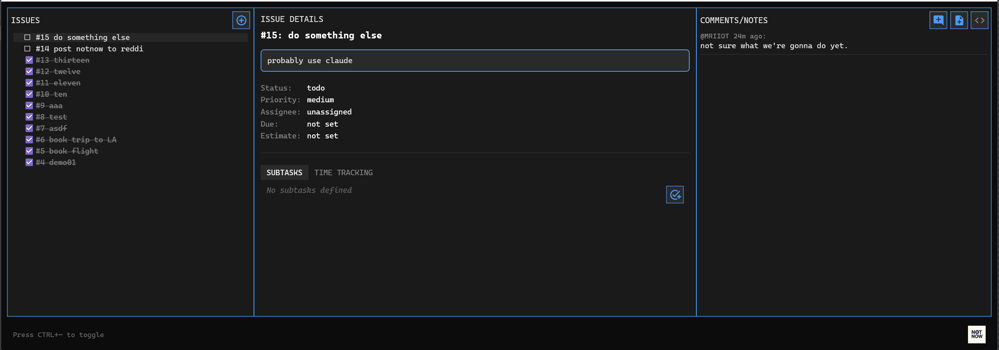

#  NotNow

**A GitHub-integrated task management system that helps you track work directly in your issues.**

NotNow transforms GitHub issues into a powerful task tracking system using special `/notnow` commands in issue comments. Track time, manage subtasks, set priorities, and monitor progress - all without leaving GitHub.



## 🎯 Key Features

- **GitHub-Native**: All data lives in GitHub issues and comments
- **Time Tracking**: Start/stop work sessions with automatic duration tracking
- **Subtask Management**: Break down issues into smaller, manageable tasks
- **Rich Metadata**: Set priorities, estimates, due dates, and assignees
- **Two Interfaces**: Console app for automation, Quake-style overlay for quick access

## 🚀 Applications

NotNow includes two powerful applications:

### [**NotNow.Console**](NotNow.Console/README.md)
A command-line tool for managing GitHub issues with NotNow commands. Perfect for automation, scripts, and terminal workflows.

```bash
notnow issue create "Fix login bug" --type bug --priority high
notnow time start -d "Working on authentication"
notnow subtask add "Write unit tests" --estimate 2h
```

### [**NotNow.Quake**](NotNow.Quake/README.md)
A Quake-style dropdown terminal overlay (Windows) for instant access to your GitHub issues. Toggle with `Ctrl+~` for a seamless workflow.

- Always-on-top terminal interface
- Visual issue management with checkboxes
- Real-time subtask tracking
- Integrated comment and note system

## 📝 NotNow Commands

Commands are posted as GitHub comments and processed to update issue state:

```bash
/notnow init                           # Initialize issue for NotNow tracking
/notnow status in-progress              # Update issue status
/notnow priority high                   # Set priority level
/notnow estimate 4h                     # Add time estimate
/notnow assign @username                # Assign to user
/notnow due 2025-12-31                 # Set due date

# Subtask Management
/notnow subtask add "Task name" --id st1 --estimate 2h
/notnow complete st1                   # Mark subtask as complete
/notnow reopen st1                     # Reopen a subtask

# Time Tracking
/notnow start -d "Working on feature"  # Start work session
/notnow stop                           # End work session
/notnow time 2h30m -d "Fixed bug"     # Log time manually
```

## 🏗️ Architecture

```
NotNow/
├── NotNow.Core/            # Core business logic and command processing
├── NotNow.GitHubService/   # GitHub API integration (Octokit)
├── NotNow.Console/         # CLI application
└── NotNow.Quake/          # MAUI-based GUI overlay (Windows)
```

## 🔧 Setup

1. **Create a GitHub Personal Access Token**
   - Go to GitHub Settings → Developer settings → Personal access tokens
   - Generate a token with `repo` scope

2. **Configure your credentials**
   ```json
   {
     "GitHub": {
       "PersonalAccessToken": "your-token",
       "Owner": "your-username-or-org",
       "Repository": "your-repo"
     }
   }
   ```

3. **Choose your interface**
   - [Console Setup Guide](NotNow.Console/README.md#setup)
   - [Quake Overlay Setup Guide](NotNow.Quake/README.md#setup)

## 💡 Use Cases

- **Development Teams**: Track time and progress without leaving your development flow
- **Project Management**: Monitor task completion and time estimates directly in GitHub
- **Freelancers**: Accurate time tracking for client billing
- **Open Source**: Coordinate work on issues with clear task breakdowns

## 🤝 Contributing

Contributions are welcome! Please feel free to submit issues, feature requests, or pull requests.

## 📄 License

This project is licensed under the MIT License - see the LICENSE file for details.

---

**NotNow** - Because sometimes the best time to track your work is... not now, but automatically! 🚀